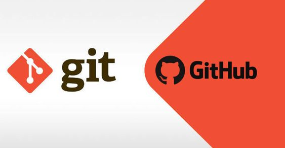
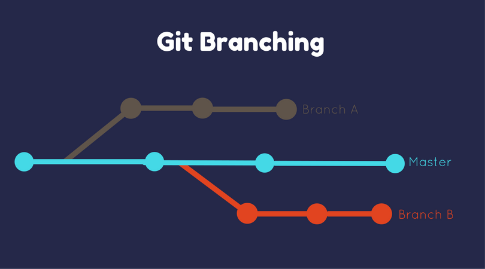
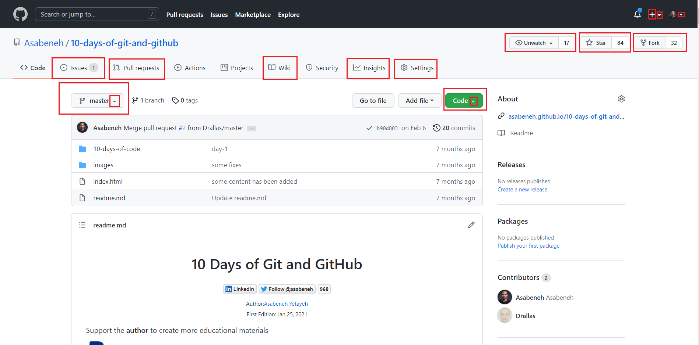

## Table of Contents
1. [What is Version Control?](#what-is-version-control)
2. [Why is Version Control Important?](#why-is-version-control-important)
3. [Introduction to Git](#introduction-to-git)
   - [Key Features of Git](#key-features-of-git)
   - [The .git Directory and How Git Tracks Changes](#the-git-directory-and-how-git-tracks-changes)
   - [How Does the .git Directory Get Created?](#how-does-the-git-directory-get-created)
   - [Ways to Use Git](#ways-to-use-git)
4. [Why Use Git and GitHub?](#why-use-git-and-github)
   - [What is GitHub?](#what-is-github)
5. [Setting Up and Configuring Git](#setting-up-and-configuring-git)
   - [Installing Git](#installing-git)
   - [Configuring Git](#configuring-git)
6. [Basic Git Commands](#basic-git-commands)
   - [Creating a New Repository](#creating-a-new-repository)
   - [Cloning an Existing Repository](#cloning-an-existing-repository)
   - [Adding and Committing Changes](#adding-and-committing-changes)
   - [Viewing the Commit History](#viewing-the-commit-history)
7. [Git Workflow: Cloning, Editing, Committing, and Pushing](#git-workflow-cloning-editing-committing-and-pushing)
8. [Understanding Branches in Git](#understanding-branches-in-git)
   - [Introduction to Branches](#introduction-to-branches)
   - [Benefits of Branches](#benefits-of-branches)
   - [Creating Branches](#creating-branches)
   - [Best Practices for Naming Branches](#best-practices-for-naming-branches)
   - [Switching Between Branches](#switching-between-branches)
   - [Practical Example](#practical-example)
9. [Merging Branches and Handling Conflicts in Git](#merging-branches-and-handling-conflicts-in-git)
   - [Introduction to Merging](#introduction-to-merging)
   - [What is Merging?](#what-is-merging)
   - [How to Merge Branches](#how-to-merge-branches)
   - [Handling Merge Conflicts](#handling-merge-conflicts)
   - [Practical Example](#practical-example-1)
   - [Best Practices for Conflict Resolution](#best-practices-for-conflict-resolution)
10. [Introduction to GitHub](#introduction-to-github)
    - [Welcome to GitHub!](#welcome-to-github)
    - [Why GitHub?](#why-github)
    - [Creating a GitHub Account](#creating-a-github-account)
    - [Exploring the GitHub Interface](#exploring-the-github-interface)
11. [Working with Repositories on GitHub](#working-with-repositories-on-github)
    - [Introduction to GitHub Repositories](#introduction-to-github-repositories)
    - [Forking a Repository](#forking-a-repository)
    - [Cloning a Repository from GitHub](#cloning-a-repository-from-github)
    - [Integrating Git with GitHub](#integrating-git-with-github)
    - [Creating a New Repository on GitHub](#creating-a-new-repository-on-github)
    - [Cloning Your Repository](#cloning-your-repository)
    - [Making Changes and Committing](#making-changes-and-committing)
    - [Pushing Changes to GitHub](#pushing-changes-to-github)
    - [Working with Branches](#working-with-branches)
    - [Collaborating Through Pull Requests](#collaborating-through-pull-requests)
12. [Exercises](#exercises)

---

## What is Version Control?

Version control is a system that tracks changes to files over time, allowing teams to work together without conflicts and providing the ability to revert to previous versions.


## Why is Version Control Important?

- **Collaboration**: Enables multiple people to work on the same project without overwriting each other's changes.
- **Backup & Restore**: Easily revert to earlier versions of a project if needed.
- **Branching & Merging**: Work on features or fixes in parallel and merge them smoothly.
- **Tracking**: Keeps a history of changes, ensuring accountability and transparency.

There are two main types of VCS:

1. **Centralized Version Control Systems (CVCS)**: All versions of the project are stored on a central server, and developers pull the latest version to work on locally.
2. **Distributed Version Control Systems (DVCS)**: Each developer has a full copy of the project, including its history, locally. This allows more flexibility in collaboration, and Git is an example of this system.

Git, as a DVCS, is one of the most widely used VCSs, known for its speed, reliability, and support for branching and merging.

---

## 1.2 Introduction to Git

### What is Git?

Git is a free, open-source distributed version control system used to efficiently manage projects of all sizes. It is the most popular version control tool today.

### Key Features of Git:~

- **Speed and Efficiency**: Git is designed for fast performance, especially with operations like commits, merges, and branching.
- **Distributed Nature**: Every user has a full copy of the repository, ensuring both data redundancy and integrity.
- **Branching Model**: Git’s lightweight branching makes creating and merging branches easy, encouraging flexible workflows without slowing down the process.

### The .git Directory and How Git Tracks Changes

- The `.git` directory is where Git stores all information about your project. Without this directory, your project is not considered a Git project.
- The `.git` directory stores:
  - Remote information (server connections)
  - History of all local commits
  - Branch information (the current state of the project)
  - Logs of all commits, including reverts

### How Does the .git Directory Get Created?

- **For New Projects**: Run the command `git init` in your project folder.
- **For Existing Projects**: The `.git` directory is created when you clone a repository using the command `git clone <repo-url>`.

### Ways to Use Git:

- **Via Terminal** using Git commands.
- **GitHub Desktop App**: A graphical interface for Git.

---

## 1.3 Why Use Git and GitHub?

### Why Use Git in Development?

- Git helps **simplify collaboration** among developers.
- It allows multiple people to work on the same file without overwriting others' work through **automatic merging**.
- Git provides a **diffing** feature, enabling comparison between file versions.

### What is GitHub?

- GitHub is an online platform that hosts Git repositories, allowing collaboration from anywhere in the world.
- It provides additional tools for managing code and teams beyond what Git offers locally.

---

## Setting Up and Configuring Git

Welcome to your introduction to version control! In this guide, you’ll learn how to install Git and configure it for personal use. By the end, you’ll be ready to start tracking your projects.

---

### Installing Git

**Windows:**
1. Download the Git installer from the official [Git website](https://git-scm.com).
2. Run the installer, following the default options.
3. Verify the installation by typing `git --version` in Command Prompt.

**macOS:**
1. Install via Homebrew by running:
   ```bash
   brew install git
   ```
2. Alternatively, download Git from the official website.
3. Verify by typing `git --version` in the Terminal.

**Linux:**
1. Open your terminal.
2. Install Git using your distribution’s package manager:
   - **Ubuntu/Debian:**
     ```bash
     sudo apt-get update
     sudo apt-get install git
     ```
   - **Fedora:**
     ```bash
     sudo dnf install git
     ```
3. Verify the installation by typing `git --version`.

---

### Configuring Git

After installation, configure Git with your name and email. This info will appear in your commits.

1. **Open Terminal/Command Prompt.**
2. **Set Your User Name:**
   ```bash
   git config --global user.name "Your Name"
   ```
3. **Set Your Email:**
   ```bash
   git config --global user.email "youremail@example.com"
   ```
4. **Check Your Configuration:**
   ```bash
   git config --list
   ```

---

## Basic Git Commands

---

### Creating a New Repository

To create a new Git repository:

1. Navigate to your desired directory in the terminal.
2. Run:
   ```bash
   git init
   ```
   This creates a `.git` subdirectory for tracking your project.

---

### Cloning an Existing Repository

To clone a remote repository:

1. **Copy the Repository URL** (e.g., from GitHub).
2. In the terminal, navigate to your target directory.
3. Run:
   ```bash
   git clone https://github.com/exampleuser/example-repo.git
   ```
   This creates a local copy of the repository.

---

### Adding and Committing Changes

**Adding Changes:**
- Stage changes with:
  ```bash
  git add filename.txt  # For specific file
  ```
  or
  ```bash
  git add .  # To add all changes
  ```

**Committing Changes:**
- Save your changes with a message:
  ```bash
  git commit -m "Your commit message"
  ```

---


### Viewing the Commit History

To view your commit history:

1. Make sure you’re in your repository’s directory.
2. Run:
   ```bash
   git log
   ```
   For a concise view, use:
   ```bash
   git log --oneline
   ```

---


---
## Exercises

- [Exercise-1](https://docs.google.com/document/d/1dVIihVGhoLQ9kbQGrP2jpMZZZSPXOClub_W5mrf_T1I/edit?usp=sharing)

---
## Git Workflow: Cloning, Editing, Committing, and Pushing

### Creating a Repository

- To create a repository on GitHub:
  1. Sign up and log into [GitHub](https://github.com).
  2. In the upper-right corner, click **New** to create a repository.
  3. Name your repository, add a description, and initialize it with a `README.md` file.

### Cloning a Repository

- To clone an existing repository:
  ```bash
  git clone <URL>
  ```
- Find the URL in the repository under the **Code** button on GitHub.

### Committing Changes

- After editing files, commit changes:
  ```bash
  git commit -m "Your message here"
  ```

### Pulling and Pushing Changes

- **Before pushing**, always pull the latest changes:
  ```bash
  git pull
  ```
- **Push your changes**:
  ```bash
  git push
  ```

---
1. Create a local repository named `LocalRepoProject` with a `hello.txt` file containing "Hello, Git and GitHub!" and set the branch to `main`.  
2. Add and commit `hello.txt` with a message: "Add hello.txt with greeting."  
3. Create a GitHub repository named `LocalRepoProject`, link it to the local repo, and push the changes to the `main` branch.

---

1. You've created a repository on GitHub named "repo-name". Now, you want to clone this repository to your local machine.
2. Inside the newly cloned repository, you create a text file named `file.txt`. You want to track this file in Git.
3. After staging `file.txt`, you decide to commit your changes with a descriptive message. 
4. You want to see a summary of the changes you've made so far. 
5. You decide to push your changes to the remote GitHub repository. The repository URL is already set up.
6. You make further changes to `file.txt`** and decide to check the status to see which files need to be staged.
7. You want to push the changes you've made in `file.txt` to GitHub.
  
--- 
### 1: Clone the Repository
Begin by cloning the repository from GitHub into a directory named `TobeLocal` and navigate into that directory.
### 2: Make Changes and Commit
Within the `TobeLocal` directory, create a new file called `notes.txt`, add a specific text to it, and commit the changes.
### 3: Fork and Link the Repository
Fork the repository to your own GitHub account, and then update your local repository to point to the newly created fork by modifying the remote URL.
### 4: Push Further Changes
Make additional modifications to `notes.txt`, commit those changes, and push them to your forked repository. 

## Understanding Branches in Git

### Introduction to Branches

Branches in Git are pointers to specific snapshots of your changes. When you create a project, Git automatically creates a main branch (often called `master` or `main`). Think of branches as parallel universes where you can work on different features or bug fixes without affecting the main project. This enables multiple developers to collaborate safely and isolate their changes until they’re ready to merge.

### Benefits of Branches

- **Flexibility**: Work on changes in isolation from the main project.
- **Collaboration**: Allow parallel development among team members.
- **Experimentation**: Try new ideas without risking project stability.

### Creating Branches

1. **Open your terminal** and navigate to your Git project directory.
2. Use the command:
   ```bash
   git branch <branch-name>
   ```
   This creates a new branch but does not switch to it.

### Best Practices for Naming Branches

- Use short, descriptive names.
- Incorporate task identifiers if linked to specific tasks.
- Separate words with hyphens for readability.

### Switching Between Branches

To switch branches and update your working directory:

- **Switch to an existing branch**:
  ```bash
  git checkout <branch-name>
  ```
- **Create a new branch and switch to it**:
  ```bash
  git checkout -b <new-branch-name>
  ```

### Practical Example

1. **Create a new branch named `feature-x` and switch to it**:
   ```bash
   git checkout -b feature-x
   ```
2. **Make some changes in your project under this branch** (e.g., create or edit a file).
3. **Switch back to your main branch**:
   ```bash
   git checkout main
   ```
4. **Reflect** on how the changes made in `feature-x` are isolated from the main branch.

---

## Merging Branches and Handling Conflicts in Git

### Introduction to Merging

Merging is a key Git operation that combines the histories of separate branches into one. It’s primarily used to integrate changes from a feature branch back into the main branch after development is complete.

### What is Merging?

- **Integration**: Merging takes changes from a source branch and integrates them into a target branch, typically the main branch.
- **Non-Destructive**: The source branch's history remains intact, allowing for ongoing development.

### How to Merge Branches

1. **Switch to the Target Branch**:
   ```bash
   git checkout main
   ```
2. **Merge the Source Branch**:
   ```bash
   git merge feature-x
   ```
   If successful, Git will create a merge commit, combining the histories of both branches.


### Handling Merge Conflicts

Conflicts occur when Git can’t automatically reconcile differences between branches. Here’s how to manage them:

#### Identifying Merge Conflicts

When a conflict arises, Git pauses the merge and marks conflicting sections in the affected files with:

- `<<<<<<< HEAD`: Current branch changes
- `=======`: Divider
- `>>>>>>> [other branch name]`: Changes from the other branch

#### Resolving Merge Conflicts

1. **Identify Conflicts**: Open affected files to find conflict markers.
2. **Understand Markers**: Review changes from both branches.
3. **Resolve the Conflict**:
   - Choose one change, merge manually, or create a new solution.
   - Remove conflict markers after editing.
4. **Test Your Changes**: Ensure the resolution doesn’t introduce errors.
5. **Finalize Resolution**:
   - Stage resolved files:
     ```bash
     git add <file-name>
     ```
   - Complete the merge:
     ```bash
     git commit
     ```

### Practical Example

1. **Create a Conflict**: Make different changes to the same part of a file on two branches.
2. **Attempt to Merge**: Merge one branch into the other to trigger the conflict.
3. **Resolve the Conflict**: Follow the outlined steps to resolve and complete the merge.

### Best Practices for Conflict Resolution

- **Communicate**: Discuss conflicts with your team, especially with the original code author.
- **Stay Updated**: Regularly pull changes from the main branch into your feature branch to minimize conflicts.
- **Use GUI Tools**: Consider graphical tools or IDEs for a more visual approach to resolving conflicts.

---

## Exercises

1.You decide to name your branch `feature-info`. To create and switch to this new branch, _______  
 After creating `feature-details.txt` and adding the necessary feature information, you stage the file for commit with: ____ 
You're ready to commit your staged changes. You decide on a commit message that clearly describes your addition. ______ 
Now that your feature is ready, you need to switch back to the main branch to prepare for merging your changes.  ________
The main branch is named `main`. To switch back, you use:_____________ 
With your feature complete and tested, it's time to merge `feature-info` into the `main` branch. ________________

2. 1. Create and switch to the `installation-updates` branch.  
   2. Add "Installation" instructions to `README.md`, stage the file, and commit the changes.  
   3. Switch back to the `main` branch.  
   4. Create and switch to the `usage-updates` branch.  
   5. Add "Usage" instructions to `README.md`, stage the file, and commit the changes.  
   6. Switch to the `main` branch and merge the `installation-updates` branch.  
   7. Merge the `usage-updates` branch into `main`.
3.Create a new branch named `feature-updates` from the `main` branch. On this branch:  

   1. Add a new file named `FEATURES.md` with a list of three features.  
   2. Stage and commit the changes with an appropriate message.  
   3. Create a sub-branch named `feature-details` from `feature-updates`.  
   4. Add a detailed description for each feature in `FEATURES.md`.  
   5. Stage and commit the updates with an appropriate message.  
   6. Switch back to the `feature-updates` branch and merge the `feature-details` branch.  
   7. Finally, merge the `feature-updates` branch into `main`.  

Ensure all branches are deleted after completing the task, except `main`.

- [Exercise 1](https://docs.google.com/document/d/1fw9H0Qk7Qz_pbqo9nCaMq79QV_lB8aPnD66z8ENvdfA/edit?usp=sharing)
- [Exercise 2](https://docs.google.com/document/d/173xu7YquYIuSzZs-A6wxvHb_Q2yTxHPzR9lzrXjKTac/edit?usp=sharing)

---


## Introduction to GitHub
.png)
### Welcome to GitHub!

GitHub is the world's leading software development platform, where millions of developers and companies build, ship, and maintain software projects across various languages.

### Why GitHub?

- **Collaboration**: GitHub simplifies project collaboration, whether for team projects or open-source contributions.
- **Version Control**: Built on Git, it offers a robust framework for managing changes and tracking project history.
- **Open Source**: With millions of repositories, GitHub is a valuable resource for inspiration, contributions, and project forking.

### Creating a GitHub Account

1. **Visit GitHub**: Go to the [GitHub website](https://github.com).
2. **Sign Up**: Click "Sign Up" and provide a username, email, and password.
3. **Verify Your Email**: Click the verification link sent to your email.
4. **Set Up Your Profile**: Optionally add a profile picture, bio, and other details.

### Exploring the GitHub Interface

After creating your account, familiarize yourself with these key areas:

- **Dashboard**: View activity feeds from repositories and discover new projects.
- **Repositories**: Create or explore repositories for your projects.
- **Issues**: Track tasks, enhancements, and bugs for your projects.
- **Pull Requests**: Share changes with collaborators and review potential modifications.
- **GitHub Actions**: Automate workflows for building, testing, and deploying code.

---

## Working with Repositories on GitHub

### Introduction to GitHub Repositories

Repositories, or "repos," are the core of GitHub, serving as directories that store all project files, including their revision history. Repositories can be public or private and may contain code, documentation, images, and more. Understanding how to interact with repositories is essential for leveraging GitHub effectively.

###  Forking

A forking is a process of owning other repository. After you clicked on fork button of a certain repository you will see that that repository became in your repository list. You can try by clicking the fork button on this repository.

Every repository that has some content in it has an active fork button on the right top corner.


After forking, we can clone the repository and work on the cloned version of the project. After modifiying the original we can push to the forked verion of the repository. In addition, we can send a pull request to the original repo to contribute on the project.

_Congratulations! Now, you have a solid foundation of Git and GitHub_

## Git cheat sheet:

Here you have the basic git commands which might be useful:

```bash
git --version     # Check the version
git help          # Get help from git
git help commit   # Get help for the commit command
git config        # Get information about configuration
git config --list # Check all what is configured
git config --global user.name "username" # Configuring git user name
git config --global user.email "email"   # Configuring git user email

git init          # Initialize git repository local machine
git status        # Check changes or status of file(s) in repository

git add filename1.txt # Adding only one file
git add filename1.txt filename2.txt # Add multiple files
git add . # Add all the files and folders to the staging area

git commit -a # Stage and write a commit message in Nano
git commit -m "commit message" # Write a commit message after staging
git commit -am "commit message" # Grab everything & skip the stage process

git log  # See the history on the repository
git log --oneline
git log -<limit>
git log --author ="name" # To check change by specific user
git log --graph # Visualize the history

git diff # Compare working copy in the repository
git diff --staged # Compare files in the staging area

git checkout -- filename # To get working copy back
git reset HEAD filename # Removes from the staging area / (unstage)
git checkout <branch-name> <path to file> # Checkout file from different branch
git checkout <commit-id> -- <path to file> # Checkout file from specific commit

git remote -v  # View remote repository-Urls
git remote add <remote name> repository-Url # Add a new remote
git push -u remote master # Push the file into github
git checkout <commit-id> -- filename #

git rm filename1 # Delete one tracked file
git mv filename1 filename2 # Delete tracked file(s)
git mv filename1 foldername/filename1 # Move file to a folder

git branch # to list branches
git branch branch-name # to create a branch
git checkout branch-name # to checkout to a certain branch
git checkout -b branch-name # to create a branch and checkout at the same time
git merge branch-name # to merge a branch to the current branch
```

## Git repository user interface features

Familiarize yourself with your GitHub account and available repository features.
Git has account setting and repository setting. Navigate through the available features.

Check the available repository features by clicking each buttons.



Check what is available on your GitHub account settings

- watch this repository
- Give start to this repository
- fork this repository
- clonge this repository


## GitHub page

Every GitHub repository allows you to generate a URL of your project. For instance, this [URL](https://asabeneh.github.io/10-days-of-git-and-github/) has been generated from this project GitHub page. To generate GitHub page URL, you should have an index.html at the top level inside the project.

First go to the setting of this repository and then click on it. Go all the way down until you get the GitHub pages section, then select the master


After you select the master, a save button will appear and click save.


After saving, a GitHub page URL will be generated automatically. That is your URL for that specific project.


## Documenting on GitHub

## GitHub Markdown

Markdown files can be used to write documentation or anything. The markdown file extension is .md

Markdown is an HTML-like markup language that allows to write text and render it on a browser. If you are familiar with HTML, you pick the syntax of markdown in a matter of minutes.
Follow this [link](https://guides.github.com/features/mastering-markdown/) to learn about markdown

## GitHub wiki

Every GitHub public repository has a wiki page. A wiki page allows you to write or document.


## Collaborating on GitHub

GitHub made open-source collaboration very easy. You can collaborate to any open-souce GitHub repository by forking the repository. In this section, let's learn how to make collaborate on an open source project:

1. First Fork the [10-days-of-git-and-github](https://github.com/Asabeneh/10-days-of-git-and-github) repository
2. After forking, clone this repository on your desktop
3. Add your favorite educational links on Education Resouces categories. You can learn how to collaborate by adding links of best educational resouces on the category below. If the category is not exist, you create a new category.

---

### Integrating Git with GitHub

---

### Creating a New Repository on GitHub

1. **Log In**: Access your GitHub account.
2. **Create Repository**: Click the **+** icon in the top-right corner and select "New repository."
3. **Set Up**: Name your repository, add a description (optional), choose public or private, and initialize with a `README.md` file.
4. **Create**: Click "Create repository."

### Cloning Your Repository

1. **Copy URL**: Click the "Code" button on your new repository and copy the URL under “Clone with HTTPS” or “Clone with SSH.”
2. **Open Terminal**: Use Git Bash or terminal.
3. **Navigate**: Use `cd` to go to your desired directory.
4. **Clone**: Run:
   ```bash
   git clone <REPOSITORY-URL>
   ```
5. **Enter Credentials**: Provide your GitHub credentials if prompted.

### Making Changes and Committing

1. **Navigate**: Go to your repository’s directory:
   ```bash
   cd <REPOSITORY-NAME>
   ```
2. **Edit**: Make changes or add files.
3. **Stage Changes**: Run:
   ```bash
   git add .
   ```
4. **Commit**: Save changes with:
   ```bash
   git commit -m "Your commit message"
   ```

### Pushing Changes to GitHub

1. **Ensure Branch**: Check your branch:
   ```bash
   git checkout main
   ```
2. **Push Changes**: Run:
   ```bash
   git push origin main
   ```

### Working with Branches

1. **Create Branch**: For a feature/bugfix:
   ```bash
   git checkout -b <BRANCH-NAME>
   ```
2. **Make Changes**: Edit, stage, and commit as before.
3. **Push Branch**: Run:
   ```bash
   git push origin <BRANCH-NAME>
   ```

### Collaborating Through Pull Requests

1. **Navigate**: Go to your repository on GitHub.
2. **Create Pull Request**: Click the "Pull requests" tab and then "New pull request."
3. **Select Branch**: Choose your branch from the “compare” dropdown.
4. **Review**: Add a title and description, then click "Create pull request."
5. **Merge**: After review, merge into the main branch.

---


